# 🏗️ Arsitektur & Scaffolding Sistem — DKP SWAG

> **The Blueprint**: Use Case, Sequence Diagram, Domain Model
> **Project**: Aplikasi Pendataan Makam & Krematorium — DKP Kota Surabaya

---

## 📑 Daftar Isi

1. [Use Case Diagram](#1-use-case-diagram)
2. [Sequence Diagram](#2-sequence-diagram)
3. [Domain Model](#3-domain-model)

---

## 1. Use Case Diagram

### 1.1 Use Case Utama (High-Level)

```mermaid
graph TB
    subgraph "🧑‍💼 Aktor"
        ADMIN["👤 Administrator"]
        PETUGAS["👤 Petugas Lapangan"]
        PEJABAT["👤 Pejabat / Kadis"]
        PELAPOR["👤 Pelapor / Ahli Waris"]
    end

    subgraph "📦 DKP SWAG System"
        UC1["🔐 Login / Logout"]
        UC2["📋 Kelola Data Almarhum"]
        UC3["🪦 Kelola Makam & Plot"]
        UC4["🔥 Kelola Krematorium"]
        UC5["📸 Input Kegiatan Harian (Giat)"]
        UC6["💰 Kelola Tagihan & Retribusi"]
        UC7["💳 Proses Pembayaran"]
        UC8["📄 Cetak Surat & Laporan"]
        UC9["🔍 Pencarian Data"]
        UC10["👥 Kelola Master Data"]
        UC11["📰 Kelola Berita"]
        UC12["📜 Lihat Log Aktivitas"]
        UC13["✍️ Tanda Tangan Elektronik"]
    end

    ADMIN --> UC1
    ADMIN --> UC2
    ADMIN --> UC3
    ADMIN --> UC4
    ADMIN --> UC5
    ADMIN --> UC6
    ADMIN --> UC7
    ADMIN --> UC8
    ADMIN --> UC9
    ADMIN --> UC10
    ADMIN --> UC11
    ADMIN --> UC12
    ADMIN --> UC13

    PETUGAS --> UC1
    PETUGAS --> UC2
    PETUGAS --> UC5
    PETUGAS --> UC9

    PEJABAT --> UC1
    PEJABAT --> UC8
    PEJABAT --> UC13
    PEJABAT --> UC9

    PELAPOR --> UC2
    PELAPOR --> UC7
```

### 1.2 Use Case Detail — Kelola Almarhum

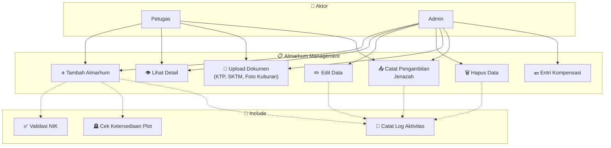

### 1.3 Use Case Detail — Tagihan & Pembayaran

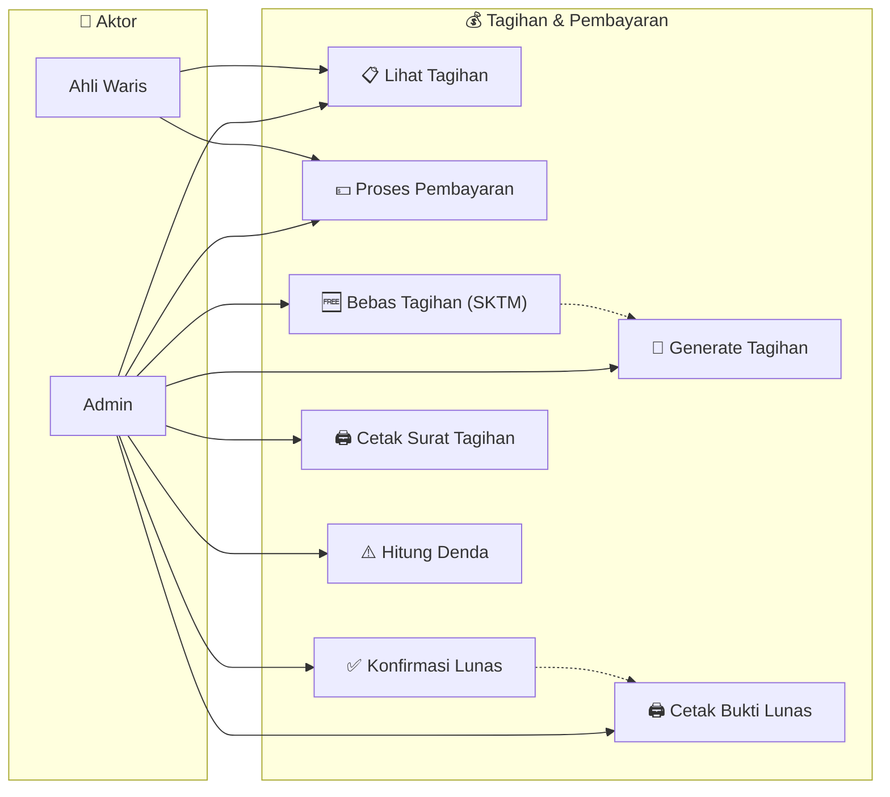

---

## 2. Sequence Diagram

### 2.1 Registrasi Almarhum Baru (Happy Path)

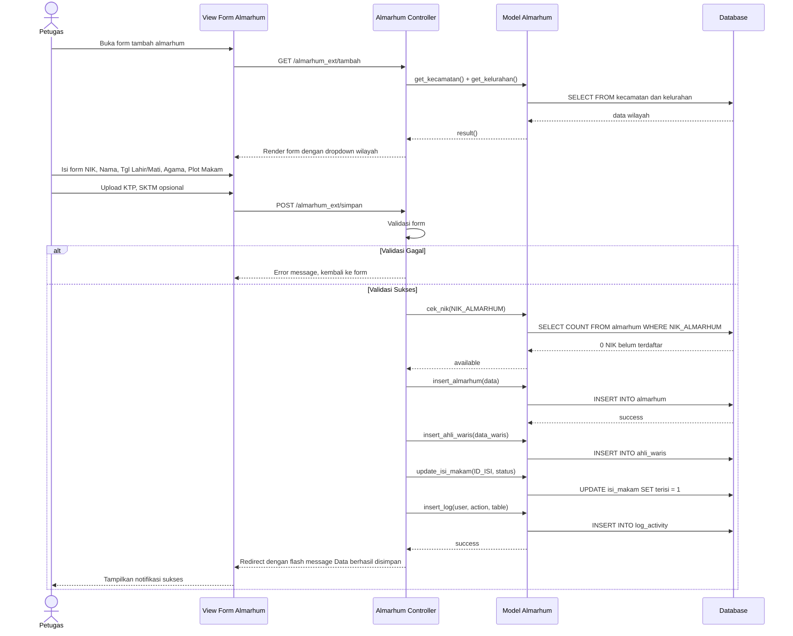

### 2.2 Proses Pembayaran & Pelunasan

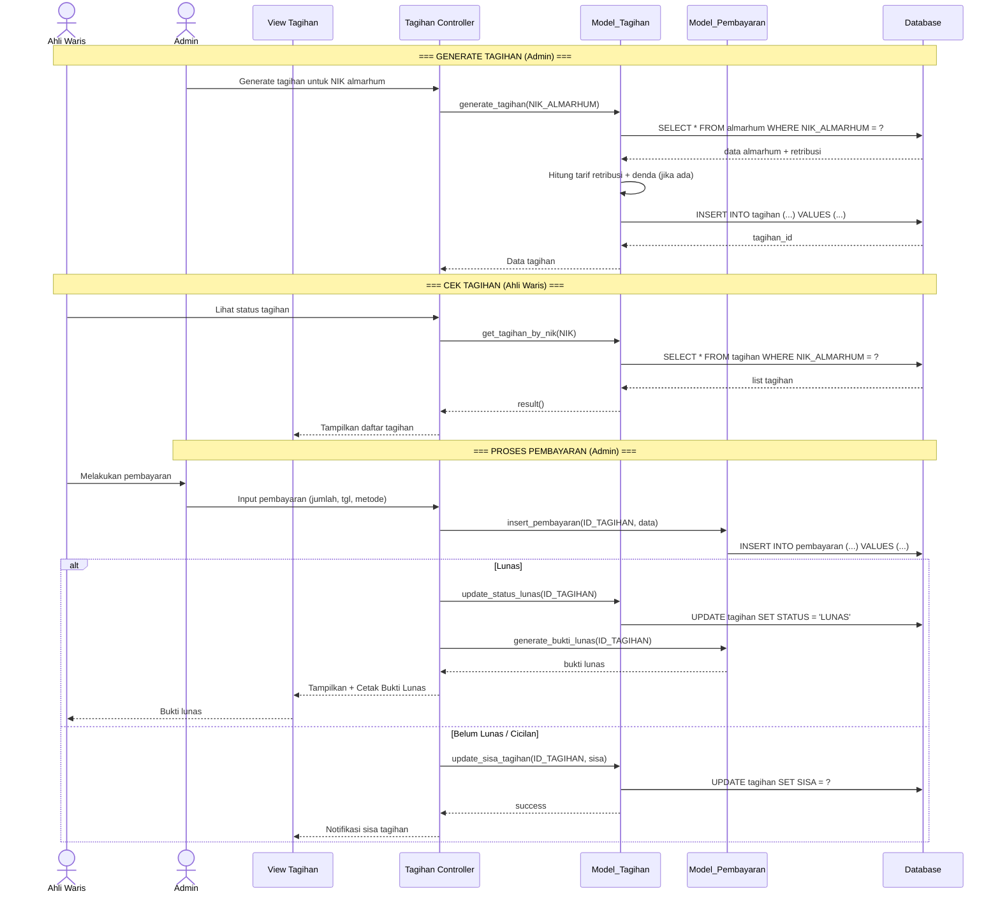

### 2.3 Cetak Laporan Pendapatan

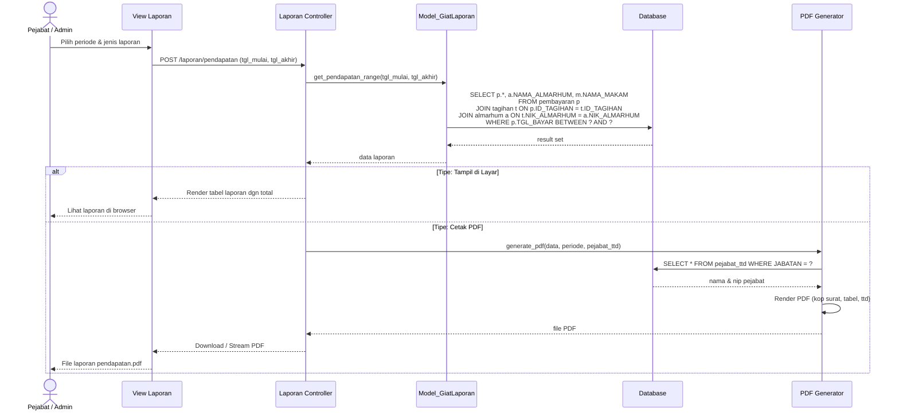

### 2.4 Autentikasi & Session

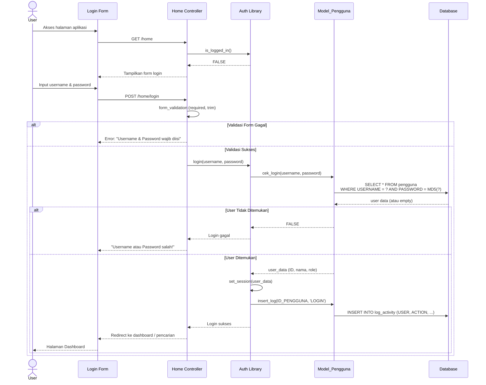

---

## 3. Domain Model

### 3.1 Entity Relationship Diagram (ERD)

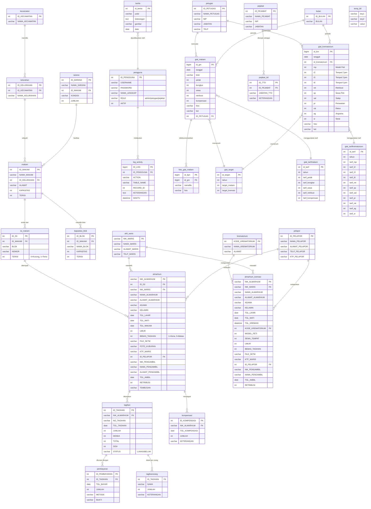

### 3.2 Class Diagram — MVC Architecture

```mermaid
classDiagram
    direction TB

    %% --- BASE ---
    class CI_Controller {
        +load model, view, library
        +input post/get
        +session
    }

    class CI_Model {
        +db query builder
        +getAll(table)
        +insert(table, data)
        +update(table, data, where)
        +delete(table, where)
    }

    %% --- CONTROLLERS ---
    class Home {
        +index()
        +login()
        +logout()
    }

    class AlmarhumExt {
        +index()
        +tambah()
        +simpan()
        +edit(NIK)
        +update()
        +hapus(NIK)
        +detail(NIK)
        +pengambilan(NIK)
        +cetak_pdf()
    }

    class GiatMakam {
        +index()
        +tambah()
        +simpan()
        +edit(id)
        +update()
        +hapus(id)
        +upload_foto()
    }

    class GiatKrematorium {
        +index()
        +tambah()
        +simpan()
        +edit(id)
        +update()
        +hapus(id)
    }

    class Tagihan {
        +index()
        +generate(NIK)
        +bayar(id_tagihan)
        +lunas(id_tagihan)
        +tolak(id_tagihan)
        +cetak_surat(id_tagihan)
        +cetak_bukti_lunas(id_tagihan)
    }

    class Laporan {
        +pendapatan()
        +pendapatanHari()
        +pembayaran()
        +cetak_pdf()
    }

    class Pencarian {
        +index()
        +cari()
        +detail(NIK)
    }

    class MasterData {
        +makam()
        +krematorium()
        +pejabat()
        +pengguna()
        +petugas()
        +sarana()
        +berita()
    }

    class LogActivity {
        +index()
        +filter()
    }

    class Cetak {
        +almarhum_pdf()
        +almarhum_krematorium_pdf()
        +all_almarhum_pdf()
        +kompensasi_pdf()
    }

    class Profil {
        +index()
        +edit()
        +update_password()
    }

    %% --- MODELS ---
    class Model_Operasional {
        +getAll(table)
        +insert(table, data)
        +update(table, data, where)
        +delete(table, where)
        +getById(table, id)
        +query(sql)
    }

    class Model_Almarhum {
        +get_all()
        +get_by_nik(NIK)
        +insert_almarhum(data)
        +update_almarhum(data, NIK)
        +delete_almarhum(NIK)
        +cek_nik(NIK)
        +get_ahli_waris(NIK)
        +insert_ahli_waris(data)
        +update_isi_makam(ID_ISI, status)
        +get_riwayat_pengambilan()
    }

    class Model_AlmarhumKrematorium {
        +get_all()
        +get_by_nik(NIK)
        +insert(data)
        +update(data, NIK)
        +delete(NIK)
    }

    class Model_GiatMakam {
        +get_all()
        +get_by_tanggal(tgl)
        +get_range(tgl1, tgl2)
        +insert(data)
        +update(data, id)
        +delete(id)
        +upload_foto(id, file)
    }

    class Model_GiatKrematorium {
        +get_all()
        +get_by_tanggal(tgl)
        +insert(data)
        +update(data, id)
        +delete(id)
    }

    class Model_Tagihan {
        +generate_tagihan(NIK)
        +get_tagihan_by_nik(NIK)
        +get_all_tagihan()
        +update_status_lunas(id)
        +update_sisa_tagihan(id, sisa)
        +get_detail_tagihan(id)
    }

    class Model_Pembayaran {
        +insert(data)
        +get_by_tagihan(id_tagihan)
        +get_range(tgl1, tgl2)
    }

    class Model_GiatLaporan {
        +get_pendapatan_range(tgl1, tgl2)
        +get_pendapatan_hari(tgl)
        +get_total_pendapatan(tgl1, tgl2)
        +get_rekap_giat(tgl1, tgl2)
    }

    class Model_Makam {
        +get_all()
        +get_by_id(id)
        +insert(data)
        +update(data, id)
        +delete(id)
        +get_kapasitas_blok(id_makam)
        +get_isi_makam(id_makam)
    }

    class Model_Pengguna {
        +cek_login(username, password)
        +get_all()
        +insert(data)
        +update(data, id)
        +delete(id)
    }

    class Model_Pencarian {
        +cari_by_nama(nama)
        +cari_by_nik(NIK)
        +cari_by_tanggal(tgl)
        +cari_by_makam(id_makam)
        +cari_advanced(filters)
    }

    class Model_Chart {
        +get_statistik_makam()
        +get_statistik_kremasi()
        +get_tren_pendapatan(tahun)
    }

    class Model_Cetak_PDF {
        +get_almarhum_pdf(NIK)
        +get_all_almarhum_pdf()
        +get_kompensasi_pdf(id)
        +get_almarhum_krematorium_pdf(NIK)
    }

    class Model_Kompensasi {
        +get_all()
        +insert(data)
        +get_by_almarhum(NIK)
    }

    class Model_Pejabat {
        +get_all()
        +get_ttd()
        +insert(data)
        +update(data, id)
    }

    class Model_Sarana {
        +get_all()
        +get_by_makam(id_makam)
        +insert(data)
        +update(data, id)
    }

    class Model_Kecamatan {
        +get_all()
        +get_kelurahan(id_kec)
    }

    class Model_XTagihan {
        +get_tagihan_orang(id_tagihan)
        +insert(data)
        +update(data, id)
    }

    %% --- LIBRARIES ---
    class Auth {
        +is_logged_in()
        +login(user, pass)
        +logout()
        +set_session(data)
        +get_user()
        +cek_role(role)
    }

    class Template {
        +set(key, value)
        +load(template, view, data)
        +render()
    }

    class PDF_Generator {
        +generate_pdf(data, title)
        +set_kop_surat(data)
        +add_ttd(pejabat)
        +output(filename)
    }

    %% --- RELATIONSHIPS ---
    Home --|> CI_Controller
    AlmarhumExt --|> CI_Controller
    GiatMakam --|> CI_Controller
    GiatKrematorium --|> CI_Controller
    Tagihan --|> CI_Controller
    Laporan --|> CI_Controller
    Pencarian --|> CI_Controller
    MasterData --|> CI_Controller
    LogActivity --|> CI_Controller
    Cetak --|> CI_Controller
    Profil --|> CI_Controller

    Model_Almarhum --|> CI_Model
    Model_AlmarhumKrematorium --|> CI_Model
    Model_GiatMakam --|> CI_Model
    Model_GiatKrematorium --|> CI_Model
    Model_Tagihan --|> CI_Model
    Model_Pembayaran --|> CI_Model
    Model_GiatLaporan --|> CI_Model
    Model_Makam --|> CI_Model
    Model_Pengguna --|> CI_Model
    Model_Pencarian --|> CI_Model
    Model_Chart --|> CI_Model
    Model_Cetak_PDF --|> CI_Model
    Model_Kompensasi --|> CI_Model
    Model_Pejabat --|> CI_Model
    Model_Sarana --|> CI_Model
    Model_Kecamatan --|> CI_Model
    Model_XTagihan --|> CI_Model
    Model_Operasional --|> CI_Model

    Home --> Auth : uses
    Home --> Template : uses
    AlmarhumExt --> Model_Almarhum : uses
    AlmarhumExt --> Model_Makam : uses
    AlmarhumExt --> Model_Kompensasi : uses
    GiatMakam --> Model_GiatMakam : uses
    GiatKrematorium --> Model_GiatKrematorium : uses
    Tagihan --> Model_Tagihan : uses
    Tagihan --> Model_Pembayaran : uses
    Tagihan --> Model_XTagihan : uses
    Laporan --> Model_GiatLaporan : uses
    Pencarian --> Model_Pencarian : uses
    Cetak --> Model_Cetak_PDF : uses
    Cetak --> Model_Pejabat : uses
    MasterData --> Model_Makam : uses
    MasterData --> Model_Pengguna : uses
    MasterData --> Model_Pejabat : uses
    MasterData --> Model_Sarana : uses
    Profil --> Model_Pengguna : uses
```

### 3.3 Modul Dependency Map

```mermaid
graph TD
    subgraph "🌐 Presentation Layer"
        VIEWS["Views (Bootstrap + jTable)"]
        TEMPLATE["Template.php / Templatev2.php"]
    end

    subgraph "🎮 Controller Layer (15 Controllers)"
        HOME["Home\n(auth + dashboard)"]
        ALM["AlmarhumExt\n(CRUD almarhum)"]
        G_MKM["GiatMakam\n(kegiatan makam)"]
        G_KRM["GiatKrematorium\n(kegiatan kremasi)"]
        G_LAP["GiatLaporan\n(rekap + chart)"]
        G_TGT["GiatTarget\n(target tahunan)"]
        G_TM["GiatTarifMakam\n(tarif makam)"]
        G_TK["GiatTarifKrematorium\n(tarif kremasi)"]
        TAGIHAN["Tagihan\n(keuangan)"]
        LAPORAN["Laporan\n(pendapatan)"]
        CARI["Pencarian\n(search engine)"]
        CETAK["Cetak\n(PDF generator)"]
        MASTER["MasterData\n(kelola referensi)"]
        LOG_C["Log\n(audit trail)"]
        PROFIL["Profil\n(user settings)"]
    end

    subgraph "🗄️ Model Layer (30 Models)"
        M_ALM["Model_Almarhum"]
        M_ALMK["Model_AlmarhumKrematorium"]
        M_GM["Model_GiatMakam"]
        M_GK["Model_GiatKrematorium"]
        M_GL["Model_GiatLaporan"]
        M_TAG["Model_Tagihan"]
        M_BAYAR["Model_Pembayaran"]
        M_XTAG["Model_XTagihan"]
        M_MAKAM["Model_Makam"]
        M_BLOK["Model_BlokKapasitas"]
        M_KREM["Model_Krematorium"]
        M_COMP["Model_Kompensasi"]
        M_CARI["Model_Pencarian"]
        M_CPDF["Model_Cetak_* (4 models)"]
        M_CHART["Model_Chart"]
        M_PENGGUNA["Model_Pengguna"]
        M_PETUGAS["Model_Petugas"]
        M_PEJABAT["Model_Pejabat"]
        M_SARANA["Model_Sarana"]
        M_KEC["Model_Kecamatan"]
        M_BERITA["Model_Berita"]
        M_OP["Model_Operasional (base)"]
    end

    subgraph "🛠️ Libraries / Helpers"
        AUTH["Auth Library\n(session + role)"]
        PDF_LIB["PDF Library\n(TCPDF)"]
        FORM_VAL["Form Validation"]
    end

    subgraph "🗃️ Database"
        DB[("MariaDB\ndkp_swag\n(29 tables)")]
    end

    VIEWS --> TEMPLATE
    TEMPLATE --> HOME
    TEMPLATE --> ALM
    TEMPLATE --> G_MKM
    TEMPLATE --> TAGIHAN

    HOME --> AUTH
    HOME --> M_OP
    HOME --> M_BERITA

    ALM --> M_ALM
    ALM --> M_MAKAM
    ALM --> M_COMP
    ALM --> M_KEC

    G_MKM --> M_GM
    G_MKM --> M_OP

    G_KRM --> M_GK
    G_KRM --> M_KREM

    G_LAP --> M_GL
    G_LAP --> M_CHART

    G_TGT --> M_OP
    G_TM --> M_OP
    G_TK --> M_OP

    TAGIHAN --> M_TAG
    TAGIHAN --> M_BAYAR
    TAGIHAN --> M_XTAG
    TAGIHAN --> M_ALM

    LAPORAN --> M_GL
    LAPORAN --> M_BAYAR

    CARI --> M_CARI
    CARI --> M_ALM

    CETAK --> M_CPDF
    CETAK --> M_PEJABAT

    MASTER --> M_MAKAM
    MASTER --> M_BLOK
    MASTER --> M_KREM
    MASTER --> M_PENGGUNA
    MASTER --> M_PETUGAS
    MASTER --> M_PEJABAT
    MASTER --> M_SARANA
    MASTER --> M_BERITA

    LOG_C --> M_OP
    PROFIL --> M_PENGGUNA

    M_ALM --> DB
    M_GM --> DB
    M_TAG --> DB
    M_BAYAR --> DB
    M_MAKAM --> DB
    M_PENGGUNA --> DB
    M_OP --> DB
    M_CPDF --> DB

    AUTH --> M_PENGGUNA
    M_PENGGUNA --> DB
```

### 3.4 Alur Data — Flow Diagram

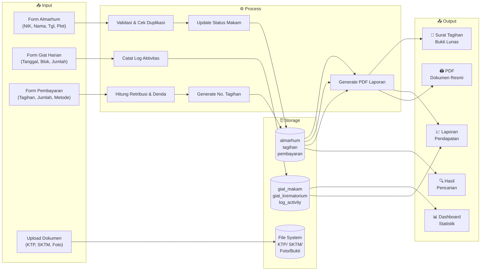

---

## 📊 Ringkasan Blueprint

| Diagram                       | Cakupan                                                                     |
| ----------------------------- | --------------------------------------------------------------------------- |
| **Use Case Diagram**    | 3 level: High-level (13 use case, 4 aktor), Detail Almarhum, Detail Tagihan |
| **Sequence Diagram**    | 4 alur: Registrasi Almarhum, Pembayaran, Cetak Laporan, Autentikasi         |
| **Domain Model (ERD)**  | 29 tabel lengkap dengan relasi, primary key, foreign key, dan atribut       |
| **Class Diagram (MVC)** | 15 Controller, 30 Model, 3 Library, lengkap dengan method signature         |
| **Dependency Map**      | Arsitektur 4-layer: Presentation → Controller → Model → Database         |
| **Flow Diagram**        | Alur data end-to-end: Input → Process → Storage → Output                 |

---

> **Blueprint ini dibuat oleh Giant Rachman Junaedi untuk menggambarkan arsitektur lengkap DKP SWAG** dari sisi bisnis (use case), alur interaksi (sequence), struktur data (domain model/ERD), organisasi kode (class diagram), hingga dependensi antar modul.
